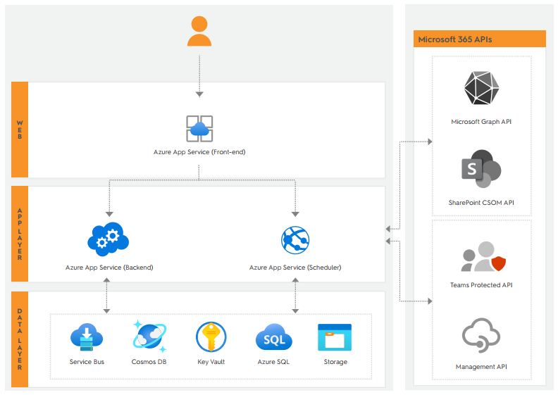

This is just an example article, but it can be useful if you're unfamiliar with the markdown syntax. 

# Overview

__SysKit Point__ is an Azure App application deployed in an Azure subscription. 
After the deployment, the key components shown in the architecture diagram below will be created and ready to run SysKit Point. 

## Getting Started
These are the 3 most important steps to get you started with SysKit Point:

1. [Deploy SysKit Point](https://www.syskit.com/products/point/documentation/?doc_page=installation/deploy-syskit-point.md) to an empty **Azure resource group**
   * Ask your **Azure team** to create a dedicated Azure resource group and deploy [SysKit Point from the Azure Marketplace](https://azuremarketplace.microsoft.com/en-us/marketplace/apps/syskitltd.syskit_point)
   * When deploying, make sure to configure Azure resources following the [minimum requirements](https://www.syskit.com/products/point/documentation/?doc_page=requirements/system-requirements.md)
   * After the deployment, you will be able to access the SysKit Point web application by opening the defined URL
2. [Activate SysKit Point](https://www.syskit.com/products/point/documentation/?doc_page=activation/activate-syskit-point.md)
    * Our team will provide the license key for the product activation after purchasing the selected edition of SysKit Point
    * At any time, you can find your keys in the [Customers Portal](https://my.syskit.com/)
    * If you do not have the activation information, please [contact us](https://www.syskit.com/company/contact-us)
3. [Connect to Your Microsoft 365 Tenant](https://www.syskit.com/products/point/documentation/?doc_page=installation/connect-to-tenant.md)
    * You will be asked to create an App registration in your Azure Active Directory
    * A **Global Administrator** will be asked to sign in and [**provide application consent**](https://www.syskit.com/products/point/documentation/?doc_page=requirements/permission-requirements.md#global-administrator) during the setup; __Please note__: the Global admin account is only necessary during the initial configuration; later, the application can be used with other non-privileged accounts

If you run into any issues when preparing your environment, please [contact us](https://www.syskit.com/contact-us/).

## First steps with SysKit Point

By now, your SysKit Point is up and running. You can sign in to the SysKit Point web application, and it will continuously collect data from Microsoft 365. There are a few important considerations to make to complete the setup and secure your Point web application:

* [**Request access to Protected APIs in Microsoft Teams**](https://www.syskit.com/products/point/documentation/?doc_page=configuration/microsoft-teams-activity.md) - Point needs **additional approval from Microsoft** to be able to **detect inactive Teams**
* [**Manage who can access Point**](https://www.syskit.com/products/point/documentation/?doc_page=configuration/enable-role-based-access.md) - by default, only **Global Administrators** and **SharePoint admins** have the rights to log in to the Point web application
* [**Setup data retention for Audit logs**](https://www.syskit.com/products/point/documentation/?doc_page=configuration/customize-audit-logs-collection.md) - depending on your company policy, set the data retention policy for stored Microsoft 365 audit logs

TODO - add Next steps